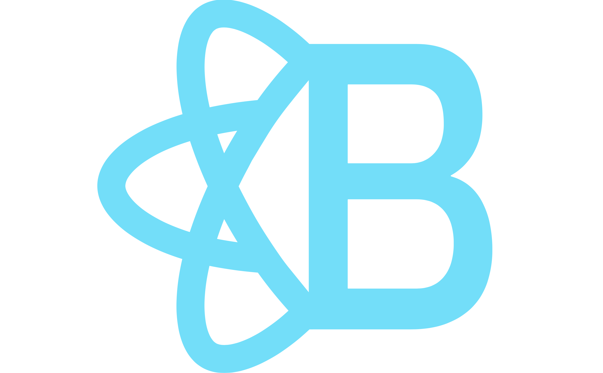

 </img>

---

***Health In One*** is an app ....

### Features include:
* Basic user details such as emergency contact details, allergy and condition alerts, and preferred pharmacy information
* Place to keep track of past appointments, when they occured with personal notes, and a section to jot down questions for future appointments
* Record of family medical history
* List of current medications and supplements along with dosages for each


## Table of Contents

  * [Project Requirements and Features List](#project-requirements-and-features-list)
  * [Technologies Used](#technologies-used)
  * [Setup](#setup)
  * [Appendix 1: Planning Documentation](#appendix-1-planning-documentation)
    * [Entity Relationship Diagrams](#entity-relationship-diagram)
    * [Wireframes](#wireframes)


## Technologies Used
  ### Development Languages and Libraries
  </img> </img>  </img> </img>

  ### Development Tools
  </img> </img> </img> </img>


## Setup
  To run Health In One locally, follow the directions below. 

  1. Clone the repository by running the following command in your terminal.
  ```sh
    git clone git@github.com:MegSemrad/nss-MeghanSemrad-Capstone1.git
  ```
  2. `cd` into the directory it creates

  3. Install the NPM dependencies for this project using the following commands
  ```sh
    npm install
  ```

  4. From your terminal window, type
  ```sh
    npm start
  ```

  5. Open another terminal window and navigate to the api folder within src. Run the followng command
  ```sh
    json-server -p 8090 -w database.json
  ```
 _____________________________________
&copy; 2020   | Web app designed by Meghan Semrad
